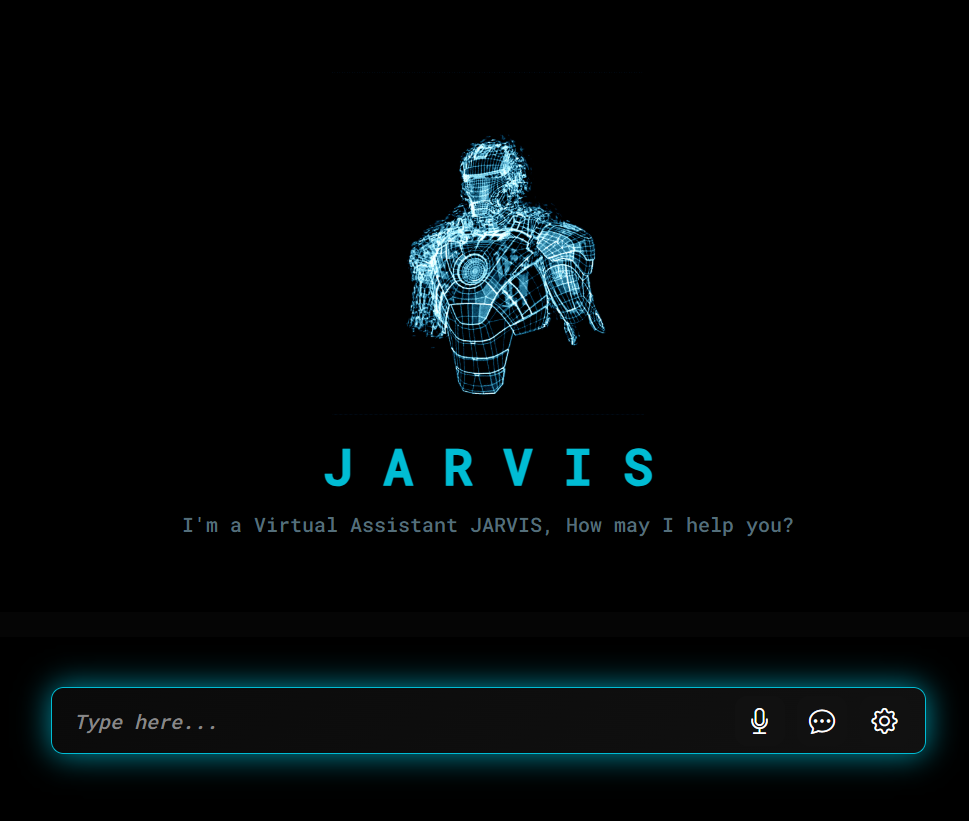
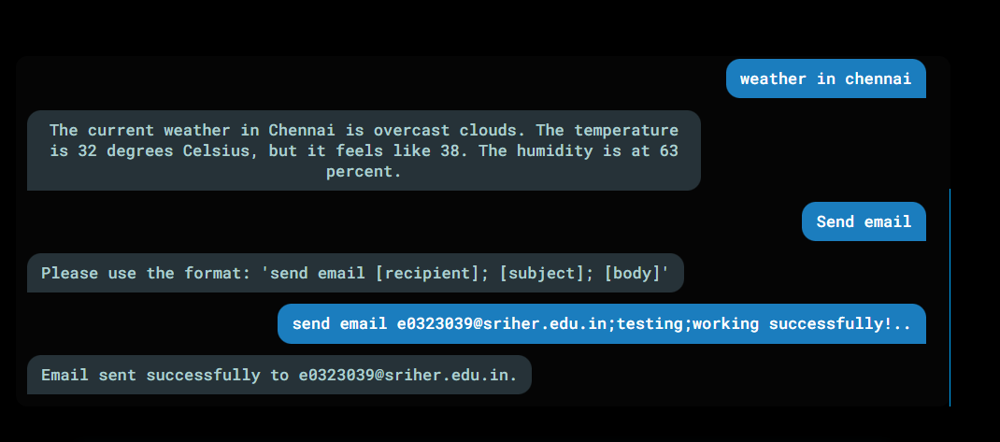

# JARVIS 🤖: Personal Voice Assistant for Windows

**JARVIS** is a personal virtual assistant inspired by Google Assistant, Alexa, and Siri. Designed for Windows, it allows **hands-free control** of desktop apps, websites, and tasks—all while keeping your data **private**.

✨ Unlike commercial assistants, JARVIS is **fully personalizable**, can **control local applications**, and doesn’t send your voice data to external servers.

---

## 🛠️ Technologies Used

* **Frontend:** HTML, CSS, JavaScript, Web Speech API
* **Backend:** Python, Flask
* **Libraries:** `requests`, `wikipedia`, `SMTPLib`, `OS`, `subprocess`
* **LLM:** Google Gemini
* **Data Format:** JSON
* **API:** OpenWeatherMap

---

## 🎯 Project Goals

* Fully **personalized voice assistant** for Windows.
* **Hands-free task automation** and information retrieval.
* **Privacy-focused:** All operations local.
* **User-friendly interface** for easy interaction.

---

## 🚀 Features

* 🗣️ **Voice Interaction:** Speak naturally; JARVIS listens and responds.
* 💻 **Task Automation:** Open apps, browse websites, send emails & WhatsApp messages.
* 🌤️ **Real-Time Data:** Check weather, news, Wikipedia summaries, and more.
* 🖥️ **User-Friendly Interface:** Clean HTML/CSS chat window in your browser.
* 🔒 **Privacy-Focused:** All operations are local; your data stays secure.

---

## 🎯 How JARVIS Works

1.  **Listen 🎤:** Frontend captures your voice using the microphone.
2.  **Request 📤:** Converts speech to text and sends a JSON request to backend:
    ```json
    {"command": "send an email to..."}
    ```
3.  **Route 🔄:** Backend identifies the command and calls the relevant function (e.g., `handle_email`).
4.  **Execute ⚡:** Backend performs the task (send email, fetch weather, open apps).
5.  **Respond 📨:** Backend returns a response message.
6.  **Speak 🔊:** Frontend shows the message and converts it to speech.

---

## 🏗️ Architecture

### Frontend (Client)

* HTML/CSS chat window in browser.
* **Voice I/O:** Web Speech API
    * **Speech-to-Text:** Converts your speech to text.
    * **Text-to-Speech:** Converts JARVIS responses to audio.
* **Communication:** Sends/receives JSON objects with backend.

### Backend (Server)

* **Framework:** Python Flask
* **Libraries & Modules:**
    * `requests` – fetch live data (news, weather).
    * `wikipedia` – get summaries of topics.
    * `smtplib` – send emails via SMTP.
    * `os` & `subprocess` – open apps and perform Windows tasks.
    * **Google Gemini** – Large Language Model for intelligent responses.
* **Data Format:** JSON
* **External APIs:** OpenWeatherMap for live weather updates.

---

## 💬 Example Commands

* "Open Notepad 📝"
* "Send an email to John 📧"
* "What’s the weather in New York? 🌤️"
* "Search Wikipedia for Artificial Intelligence 📚"
* "Send a WhatsApp message to Sarah 💬"

---
## 👩‍💻 Collaborator
**Divakar V**  
[GitHub Profile](https://github.com/divaashree)
**Madhu Shree D**
[GitHub Profile](https://github.com/MADHUSHREE2006)

---

## 🔮 Future Enhancements

* More desktop apps and productivity tool integrations.
* Multi-language support 🌐
* Contextual understanding using machine learning 🤖
* Advanced scheduling & reminder functionalities ⏰


### 🖥️ Demos and Screenshots

| JARVIS Chat Interface | Real-Time Response |
| :-------------------: | :------------------: |
|  |  |
